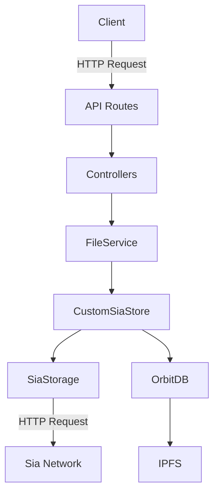

# Custom OrbitDB Storage with Sia Integration

## Table of Contents

- [Custom OrbitDB Storage with Sia Integration](#custom-orbitdb-storage-with-sia-integration)
  - [Table of Contents](#table-of-contents)
  - [1. Introduction](#1-introduction)
  - [2. System Overview](#2-system-overview)
  - [3. Prerequisites](#3-prerequisites)
  - [4. Installation](#4-installation)
  - [5. Configuration](#5-configuration)
  - [6. Core Components](#6-core-components)
    - [6.1. SiaStorage](#61-siastorage)
      - [`put` Method](#put-method)
      - [`get` Method](#get-method)
      - [Other Methods](#other-methods)
    - [6.2. CustomSiaStore](#62-customsiastore)
      - [Constructor](#constructor)
      - [`put` Method](#put-method-1)
      - [`get` Method](#get-method-1)
    - [6.3. FileService](#63-fileservice)
      - [`initOrbitDB` Function](#initorbitdb-function)
      - [`uploadFile` Function](#uploadfile-function)
      - [`downloadFile` Function](#downloadfile-function)
  - [7. API Routes and Controllers](#7-api-routes-and-controllers)
    - [7.1. Upload Route](#71-upload-route)
      - [`uploadFileController`](#uploadfilecontroller)
      - [`downloadFileController`](#downloadfilecontroller)
    - [7.2. Integrating Routes with the Server](#72-integrating-routes-with-the-server)
  - [8. Usage Examples](#8-usage-examples)
    - [Uploading a File](#uploading-a-file)
    - [Downloading a File](#downloading-a-file)
  - [9. Error Handling and Logging](#9-error-handling-and-logging)
    - [Error Handling](#error-handling)
    - [Logging](#logging)
  - [10. Performance Considerations](#10-performance-considerations)
  - [11. Security Best Practices](#11-security-best-practices)
  - [12. Troubleshooting](#12-troubleshooting)
  - [13. Extending the Solution](#13-extending-the-solution)
  - [14. Frequently Asked Questions](#14-frequently-asked-questions)
  - [15. Conclusion](#15-conclusion)

## 1. Introduction

This documentation provides a comprehensive guide to implementing and using a custom OrbitDB storage solution integrated with Sia decentralized storage. The solution allows developers to leverage the distributed nature of OrbitDB while utilizing Sia's robust and decentralized file storage capabilities.

Our custom storage solution extends OrbitDB's functionality by implementing a Sia-based storage layer. This integration enables applications to store and retrieve files using Sia's decentralized network while maintaining the familiar OrbitDB interface for database operations.

The primary goals of this solution are:

1. To provide a seamless integration between OrbitDB and Sia storage.
2. To maintain the distributed and peer-to-peer nature of data storage.
3. To offer enhanced file storage capabilities beyond OrbitDB's default storage mechanisms.

This documentation will walk you through the implementation details, usage patterns, and best practices for utilizing this custom storage solution in your projects.

## 2. System Overview

The custom OrbitDB storage with Sia integration consists of several key components working together:

1. **SiaStorage**: A custom storage adapter that interfaces with the Sia network for file uploads and downloads.
2. **CustomSiaStore**: An extension of OrbitDB's KeyValueStore that utilizes SiaStorage for data persistence.
3. **FileService**: A service layer that initializes OrbitDB with the custom storage and provides high-level file operations.
4. **API Routes and Controllers**: Express.js routes and controllers that expose file upload and download functionality to clients.

Here's a high-level overview of how these components interact:



1. The client sends HTTP requests to upload or download files.
2. API routes handle these requests and delegate to the appropriate controllers.
3. Controllers use the FileService to perform file operations.
4. FileService interacts with CustomSiaStore, which extends OrbitDB's functionality.
5. CustomSiaStore uses SiaStorage to persist and retrieve data from the Sia network.
6. OrbitDB manages the database structure and IPFS interactions.

This architecture allows for a separation of concerns while providing a unified interface for file operations that leverage both OrbitDB and Sia storage capabilities.

## 3. Prerequisites

Before implementing this custom storage solution, ensure that you have the following prerequisites in place:

1. **Node.js**: Version 14.x or higher is recommended.
2. **npm** or **yarn**: For package management.
3. **IPFS**: A running IPFS node or access to an IPFS gateway.
4. **Sia**: Access to a Sia node or a Sia hosting provider.
5. **OrbitDB**: Familiarity with OrbitDB concepts and basic usage.
6. **Express.js**: Knowledge of Express.js for creating API routes and controllers.

Additionally, you should have a basic understanding of:

- Asynchronous JavaScript and Promises
- Buffer manipulation in Node.js
- HTTP requests and responses
- Error handling in Node.js applications

## 4. Installation

To get started with the custom OrbitDB storage solution, follow these installation steps:

1. Create a new Node.js project or navigate to your existing project directory:

```bash
mkdir custom-orbitdb-sia-storage
cd custom-orbitdb-sia-storage
npm init -y
```

2. Install the required dependencies:

```bash
npm install orbit-db ipfs-core axios form-data express
```

3. Create the necessary files for the project:

```bash
touch siaStorage.js customSiaStore.js fileService.js config.js
mkdir routes controllers
touch routes/fileRoutes.js controllers/fileController.js
```

4. Set up your project structure as follows:

```
custom-orbitdb-sia-storage/
├── node_modules/
├── config.js
├── siaStorage.js
├── customSiaStore.js
├── fileService.js
├── routes/
│   └── fileRoutes.js
├── controllers/
│   └── fileController.js
├── package.json
└── server.js
```

Now that you have the basic project structure in place, we'll proceed to configure and implement each component.

## 5. Configuration

The `config.js` file will store important configuration variables for your application. Create and populate this file with the following content:

```javascript
// config.js
export default {
  S5_NODE_URL: process.env.S5_NODE_URL || 'https://your-sia-node-url.com',
  S5_CLIENT_AUTH_TOKEN: process.env.S5_CLIENT_AUTH_TOKEN || 'your-sia-auth-token',
  S5_CLIENT_PWD: process.env.S5_CLIENT_PWD || 'your-sia-password',
  PORT: process.env.PORT || 3000,
  // Add any other configuration variables as needed
};
```

Make sure to replace the placeholder values with your actual Sia node URL, authentication token, and password. It's recommended to use environment variables for sensitive information in production environments.

## 6. Core Components

### 6.1. SiaStorage

The `SiaStorage` module is responsible for interfacing with the Sia network. It provides methods for uploading and downloading files. Here's a detailed implementation of the `siaStorage.js` file:

```javascript
// siaStorage.js
import axios from 'axios';
import FormData from 'form-data';
import { Buffer } from 'buffer';
import config from './config.js';
import { Readable } from 'stream'; 

const SiaStorage = async () => {
    const put = async (hash, data) => {
        console.log("SiaStorage.put called with hash:", hash);
        try {
            const form = new FormData();
            
            // Create a Readable stream from the buffer
            const stream = new Readable();
            stream.push(data);
            stream.push(null);  // Signals the end of the stream
            
            form.append('file', stream, {
                filename: hash,
                contentType: 'application/octet-stream',
                knownLength: data.length
            });
    
            const response = await axios.post(`${config.S5_NODE_URL}/s5/upload`, form, {
                headers: {
                    ...form.getHeaders(),
                    Authorization: `Bearer ${config.S5_CLIENT_AUTH_TOKEN}`
                },
                maxBodyLength: Infinity,
                maxContentLength: Infinity
            });
    
            console.log(`File uploaded to Sia with CID: ${response.data.cid}`);
            return response.data.cid;
        } catch (error) {
            console.error('Error uploading to Sia:', error);
            throw error;
        }
    };

    const get = async (hash) => {
        console.log("SiaStorage.get called with hash:", hash);
        try {
            const authToken = Buffer.from(`${config.S5_CLIENT_PWD}`).toString('base64');
            const response = await axios.get(`${config.S5_NODE_URL}/s5/blob/${hash}`, {
                responseType: 'arraybuffer',
                headers: {
                    Authorization: `Basic ${authToken}`
                }
            });
            return Buffer.from(response.data);
        } catch (error) {
            console.error('Error downloading from Sia:', error);
            throw error;
        }
    };

    const del = async (hash) => {
        console.warn('Delete operation not supported in Sia storage');
    };

    const iterator = async function* () {
        console.warn('Iterator not implemented for Sia storage');
        yield;
    };

    const merge = async (other) => {
        console.warn('Merge operation not implemented for Sia storage');
    };

    const clear = async () => {
        console.warn('Clear operation not supported in Sia storage');
    };

    const close = async () => {
        // No specific close operation needed for Sia storage
    };

    return {
        put,
        get,
        del,
        iterator,
        merge,
        clear,
        close
    };
};

export default SiaStorage;
```

Let's break down the key components of the `SiaStorage` module:

#### `put` Method

The `put` method is responsible for uploading files to the Sia network. Here's a detailed explanation of its implementation:

1. It takes two parameters: `hash` (a unique identifier for the file) and `data` (the file content as a Buffer).
2. It creates a `FormData` object to prepare the file for upload.
3. A Readable stream is created from the Buffer to handle large file uploads efficiently.
4. The file is appended to the FormData object with the appropriate metadata.
5. An HTTP POST request is made to the Sia node's upload endpoint using axios.
6. The request includes the necessary headers, including authentication.
7. Upon successful upload, it returns the CID (Content Identifier) provided by Sia.

#### `get` Method

The `get` method retrieves files from the Sia network:

1. It takes a `hash` parameter, which is the unique identifier of the file to be retrieved.
2. An HTTP GET request is made to the Sia node's blob endpoint.
3. The request includes Basic Authentication using the configured password.
4. The response is received as an ArrayBuffer and converted to a Buffer before being returned.

#### Other Methods

The `SiaStorage` module also includes placeholder implementations for other storage operations:

- `del`: File deletion (not supported in this implementation)
- `iterator`: Iteration over stored files (not implemented)
- `merge`: Merging storage contents (not implemented)
- `clear`: Clearing all stored files (not supported)
- `close`: Closing the storage connection (no operation needed for Sia)

These methods are included to maintain compatibility with the OrbitDB storage interface, even though they are not fully implemented for Sia storage.

### 6.2. CustomSiaStore

The `CustomSiaStore` extends OrbitDB's KeyValueStore to use our SiaStorage for data persistence. Here's the implementation of the `customSiaStore.js` file:

```javascript
// customSiaStore.js
import KeyValueStore from 'orbit-db-kvstore';
import SiaStorage from './siaStorage.js';

class CustomSiaStore extends KeyValueStore {
    constructor(ipfs, id, dbname, options) {
        super(ipfs, id, dbname, options);
        this.siaStorage = options.storage || SiaStorage();
    }

    async put(key, value) {
        console.log("CustomSiaStore.put called with key:", key);
        await this.siaStorage.put(key, value);
        return super.put(key, value);
    }

    async get(key) {
        console.log("CustomSiaStore.get called with key:", key);
        const value = await this.siaStorage.get(key);
        if (value) return value;
        return super.get(key);
    }
}

export default CustomSiaStore;
```

Let's examine the key aspects of the `CustomSiaStore`:

#### Constructor

The constructor initializes the CustomSiaStore:

1. It calls the superclass constructor using `super(ipfs, id, dbname, options)`.
2. It initializes `this.siaStorage` with either the provided storage option or a new instance of `SiaStorage`.

#### `put` Method

The `put` method is overridden to use both Sia storage and the default OrbitDB storage:

1. It logs the operation for debugging purposes.
2. It calls `this.siaStorage.put(key, value)` to store the data in Sia.
3. It then calls `super.put(key, value)` to maintain the OrbitDB store's state.

#### `get` Method

The `get` method is also overridden to first attempt retrieval from Sia storage:

1. It logs the operation for debugging purposes.
2. It attempts to retrieve the value from Sia storage using `this.siaStorage.get(key)`.
3. If a value is found in Sia storage, it is returned immediately.
4. If no value is found in Sia storage, it falls back to the default OrbitDB get method using `super.get(key)`.

This implementation ensures that data is stored both in Sia and in OrbitDB's default storage, providing redundancy and maintaining compatibility with OrbitDB's operations.

### 6.3. FileService

The `FileService` module acts as an intermediary between the API layer and the storage layer. It initializes OrbitDB with our custom storage and provides high-level methods for file operations. Here's the implementation of the `fileService.js` file:

```javascript
// services/fileService.js
import { create as createIPFS } from 'ipfs-core';
import OrbitDB from 'orbit-db';
import SiaStorage from '../siaStorage.js';
import CustomSiaStore from '../customSiaStore.js';

let orbitdb;
let db;
let siaStorage;

export const initOrbitDB = async () => {
    const ipfs = await createIPFS();
    orbitdb = await OrbitDB.createInstance(ipfs);

    // Add the custom store type to OrbitDB
    OrbitDB.addDatabaseType('custom-sia-store', CustomSiaStore);

    siaStorage = await SiaStorage();

    db = await orbitdb.open('file-storage-db', {
        create: true,
        type: 'custom-sia-store',
        storage: siaStorage
    });

    console.log('Database created with custom Sia storage');

    // Add event listeners
    db.events.on('write', (address, entry, heads) => {
        console.log('Write operation occurred:', entry);
    });

    db.events.on('replicate', (address) => {
        console.log('Replication event:', address);
    });
};

export const uploadFile = async (fileName, fileBuffer) => {
    try {
        if (!db) {
            await initOrbitDB();
        }
        const cid = await db.put(fileName, fileBuffer);
        console.log(`File uploaded with CID: ${cid}`);
        return cid;
    } catch (error) {
        console.error('Error in uploadFile:', error);
        throw error;
    }
};

export const downloadFile = async (fileName) => {
    try {
        if (!db) {
            await initOrbitDB();
        }
        const fileBuffer = await db.get(fileName);
        if (!fileBuffer) {
            throw new Error('File not found');
        }
        return fileBuffer;
    } catch (error) {
        console.error('Error in downloadFile:', error);
        throw error;
    }
};
```

Let's break down the key components of the `FileService`:

#### `initOrbitDB` Function

This function initializes OrbitDB with our custom storage:

1. It creates an IPFS instance.
2. It creates an OrbitDB instance.
3. It registers our `CustomSiaStore` as a custom database type.
4. It initializes the `SiaStorage`.
5. It opens (or creates) a database using our custom store type.
6. It sets up event listeners for 'write' and 'replicate' events, which can be useful for debugging and monitoring.

This initialization process ensures that our custom Sia storage is properly integrated with OrbitDB.

#### `uploadFile` Function

The `uploadFile` function handles file uploads:

1. It checks if the database is initialized, and if not, calls `initOrbitDB()`.
2. It uses the `db.put()` method to store the file, which will utilize our custom Sia storage.
3. It returns the CID (Content Identifier) of the uploaded file.

#### `downloadFile` Function

The `downloadFile` function retrieves files:

1. It checks if the database is initialized, and if not, calls `initOrbitDB()`.
2. It uses the `db.get()` method to retrieve the file, which will first check Sia storage and then fall back to OrbitDB's default storage if necessary.
3. If the file is not found, it throws an error.
4. It returns the file content as a Buffer.

These high-level functions abstract away the complexities of the underlying storage mechanisms, providing a simple interface for file operations.

## 7. API Routes and Controllers

Now that we have our core components in place, let's implement the API routes and controllers to expose file upload and download functionality to clients.

### 7.1. Upload Route

First, let's create the upload route in `routes/fileRoutes.js`:

```javascript
// routes/fileRoutes.js
import express from 'express';
import { uploadFileController, downloadFileController } from '../controllers/fileController.js';
import multer from 'multer';

const router = express.Router();
const upload = multer({ storage: multer.memoryStorage() });

router.post('/upload', upload.single('file'), uploadFileController);
router.get('/download/:fileName', downloadFileController);

export default router;
```

In this route file, we:

1. Set up an Express router.
2. Use `multer` middleware to handle file uploads, storing the file in memory.
3. Define a POST route for file uploads, using the `uploadFileController`.
4. Define a GET route for file downloads, using the `downloadFileController`.

Now, let's implement the controllers in `controllers/fileController.js`:

```javascript
// controllers/fileController.js
import { uploadFile, downloadFile } from '../services/fileService.js';

export const uploadFileController = async (req, res) => {
    try {
        if (!req.file) {
            return res.status(400).json({ error: 'No file uploaded' });
        }

        const fileName = req.file.originalname;
        const fileBuffer = req.file.buffer;

        const cid = await uploadFile(fileName, fileBuffer);

        res.status(200).json({ message: 'File uploaded successfully', cid });
    } catch (error) {
        console.error('Error in uploadFileController:', error);
        res.status(500).json({ error: 'Internal server error' });
    }
};

export const downloadFileController = async (req, res) => {
    try {
        const { fileName } = req.params;

        const fileBuffer = await downloadFile(fileName);

        res.setHeader('Content-Disposition', `attachment; filename="${fileName}"`);
        res.setHeader('Content-Type', 'application/octet-stream');
        res.send(fileBuffer);
    } catch (error) {
        console.error('Error in downloadFileController:', error);
        if (error.message === 'File not found') {
            res.status(404).json({ error: 'File not found' });
        } else {
            res.status(500).json({ error: 'Internal server error' });
        }
    }
};
```

Let's break down these controllers:

#### `uploadFileController`

1. Checks if a file was uploaded.
2. Extracts the file name and buffer from the request.
3. Calls the `uploadFile` function from our FileService.
4. Returns the CID of the uploaded file in the response.

#### `downloadFileController`

1. Extracts the file name from the request parameters.
2. Calls the `downloadFile` function from our FileService.
3. Sets appropriate headers for file download.
4. Sends the file buffer in the response.
5. Handles specific errors, such as "File not found".

### 7.2. Integrating Routes with the Server

To use these routes, you need to integrate them into your main server file. Here's an example of how to set up the server in `server.js`:

```javascript
// server.js
import express from 'express';
import fileRoutes from './routes/fileRoutes.js';
import { initOrbitDB } from './services/fileService.js';
import config from './config.js';

const app = express();

// Initialize OrbitDB
initOrbitDB().catch(console.error);

// Use file routes
app.use('/api/files', fileRoutes);

// Start the server
app.listen(config.PORT, () => {
  console.log(`Server running on port ${config.PORT}`);
});
```

This server setup:

1. Initializes OrbitDB when the server starts.
2. Mounts the file routes under the `/api/files` path.
3. Starts the server on the configured port.

## 8. Usage Examples

Now that we have our system set up, let's look at some usage examples to demonstrate how to interact with our custom OrbitDB Sia storage solution.

### Uploading a File

To upload a file, you would send a POST request to the `/api/files/upload` endpoint. Here's an example using `curl`:

```bash
curl -X POST -H "Content-Type: multipart/form-data" -F "file=@/path/to/your/file.txt" http://localhost:3000/api/files/upload
```

Or using JavaScript with the `fetch` API:

```javascript
const formData = new FormData();
formData.append('file', fileInput.files[0]);

fetch('http://localhost:3000/api/files/upload', {
  method: 'POST',
  body: formData
})
.then(response => response.json())
.then(data => console.log('Success:', data))
.catch(error => console.error('Error:', error));
```

### Downloading a File

To download a file, you would send a GET request to the `/api/files/download/:fileName` endpoint. Here's an example using `curl`:

```bash
curl -O -J http://localhost:3000/api/files/download/example.txt
```

Or using JavaScript with the `fetch` API:

```javascript
fetch('http://localhost:3000/api/files/download/example.txt')
.then(response => response.blob())
.then(blob => {
  const url = window.URL.createObjectURL(blob);
  const a = document.createElement('a');
  a.style.display = 'none';
  a.href = url;
  a.download = 'example.txt';
  document.body.appendChild(a);
  a.click();
  window.URL.revokeObjectURL(url);
})
.catch(error => console.error('Error:', error));
```

## 9. Error Handling and Logging

Proper error handling and logging are crucial for maintaining and debugging your application. Here are some best practices for error handling and logging in this custom storage solution:

### Error Handling

1. **Use try-catch blocks**: Wrap asynchronous operations in try-catch blocks to catch and handle errors properly.

2. **Specific error types**: Create specific error types for different scenarios. For example:

```javascript
class FileNotFoundError extends Error {
  constructor(message) {
    super(message);
    this.name = 'FileNotFoundError';
  }
}
```

3. **Consistent error responses**: Ensure that your API returns consistent error responses. For example:

```javascript
res.status(404).json({ error: 'File not found', code: 'FILE_NOT_FOUND' });
```

### Logging

1. **Use a logging library**: Consider using a logging library like Winston or Bunyan for more advanced logging capabilities.

2. **Log levels**: Use appropriate log levels (e.g., info, warn, error) for different types of messages.

3. **Structured logging**: Use structured logging to make it easier to search and analyze logs:

```javascript
console.log(JSON.stringify({
  level: 'info',
  message: 'File uploaded successfully',
  fileName: fileName,
  cid: cid,
  timestamp: new Date().toISOString()
}));
```

4. **Error stack traces**: When logging errors, include the full stack trace:

```javascript
console.error('Error in uploadFile:', error.stack);
```

5. **Sensitive information**: Be cautious about logging sensitive information. Avoid logging full file contents or authentication tokens.

## 10. Performance Considerations

When working with this custom OrbitDB Sia storage solution, keep the following performance considerations in mind:

1. **File size limits**: Be aware of any file size limits imposed by your Sia node or hosting provider. Large files may require special handling or streaming uploads.

2. **Caching**: Consider implementing a caching layer (e.g., Redis) for frequently accessed files to reduce load on the Sia network.

3. **Batch operations**: If you need to upload or download multiple files, consider implementing batch operations to reduce the number of network requests.

4. **Compression**: Implement compression for large files before uploading to reduce storage costs and improve transfer speeds.

5. **Asynchronous processing**: For large file uploads or downloads, consider implementing asynchronous processing with job queues to avoid blocking the main application thread.

6. **Connection pooling**: If making many requests to the Sia node, implement connection pooling to reuse connections and reduce overhead.

7. **Monitoring and analytics**: Implement monitoring and analytics to track system performance and identify bottlenecks.

## 11. Security Best Practices

Securing your custom OrbitDB Sia storage solution is crucial. Here are some security best practices to consider:

1. **Authentication and Authorization**: Implement robust authentication and authorization mechanisms for your API endpoints.

2. **HTTPS**: Always use HTTPS in production to encrypt data in transit.

3. **Input validation**: Validate and sanitize all user inputs, including file names and contents.

4. **Rate limiting**: Implement rate limiting to prevent abuse of your API.

5. **File type restrictions**: Restrict the types of files that can be uploaded to prevent security risks.

6. **Virus scanning**: Implement virus scanning for uploaded files.

7. **Encryption**: Consider encrypting files before uploading to Sia for an extra layer of security.

8. **Access control**: Implement fine-grained access control for files stored in your system.

9. **Secure configuration**: Keep sensitive configuration data (like Sia authentication tokens) in environment variables or secure vaults.

10. **Regular security audits**: Conduct regular security audits of your system and dependencies.

## 12. Troubleshooting

When working with this custom storage solution, you may encounter various issues. Here are some common problems and their potential solutions:

1. **Issue**: Files not being stored in Sia
   **Solution**: Check your Sia node configuration and ensure you have sufficient storage allowance.

2. **Issue**: OrbitDB not syncing properly
   **Solution**: Verify your IPFS configuration and ensure peers can connect to your node.

3. **Issue**: Slow file uploads or downloads
   **Solution**: Check your network connection, Sia node health, and consider implementing caching or CDN solutions.

4. **Issue**: "File not found" errors when trying to download
   **Solution**: Verify that the file was successfully uploaded and that the correct file name is being used for download.

5. **Issue**: Out of memory errors during large file uploads
   **Solution**: Implement streaming uploads or increase your server's memory allocation.

To aid in troubleshooting, implement comprehensive logging throughout your application, especially in the custom storage components.

## 13. Extending the Solution

This custom OrbitDB Sia storage solution can be extended in various ways to meet specific project requirements:

1. **Multi-file operations**: Implement methods for uploading and downloading multiple files in a single operation.

2. **File metadata**: Extend the storage to include additional metadata about stored files (e.g., size, MIME type, creation date).

3. **Versioning**: Implement a versioning system to track changes to files over time.

4. **Access control**: Add user-based access control to restrict file access based on permissions.

5. **Search functionality**: Implement a search feature to find files based on metadata or content.

6. **Encryption**: Add client-side encryption for enhanced security.

7. **Replication**: Implement cross-node replication for improved availability and redundancy.

8. **Analytics**: Add analytics tracking for file usage and storage metrics.

When extending the solution, always consider the impact on performance, security, and usability.

## 14. Frequently Asked Questions

Here are some frequently asked questions about this custom OrbitDB Sia storage solution:

1. **Q: Can I use this solution with other decentralized storage networks?**
   A: While this implementation is specific to Sia, the architecture can be adapted to work with other decentralized storage networks like IPFS or Storj.

2. **Q: How does this solution handle large files?**
   A: The current implementation loads files into memory. For very large files, you may need to implement streaming uploads and downloads.

3. **Q: Is this solution suitable for production use?**
   A: This solution provides a foundation for integrating OrbitDB with Sia storage. However, for production use, you should thoroughly test, optimize, and secure the implementation based on your specific requirements.

4. **Q: How does this solution handle conflicts in distributed scenarios?**
   A: OrbitDB uses a CRDT (Conflict-free Replicated Data Type) approach to handle conflicts. However, for file storage, you may need to implement additional logic to handle conflicting versions of files.

5. **Q: Can I use this solution offline?**
   A: The solution requires connectivity to both IPFS and Sia networks. However, you could implement local caching to enable some offline functionality.

## 15. Conclusion

This custom OrbitDB Sia storage solution provides a powerful way to combine the distributed database capabilities of OrbitDB with the robust decentralized file storage of Sia. By following this documentation, you should be able to implement, use, and extend this solution in your own projects.

Remember to always consider security, performance, and scalability when working with distributed systems and file storage. Regular testing, monitoring, and optimization are key to maintaining a reliable and efficient system.

As decentralized technologies continue to evolve, solutions like this will play an increasingly important role in building resilient, distributed applications. We encourage you to explore, experiment, and contribute to the further development of these technologies.